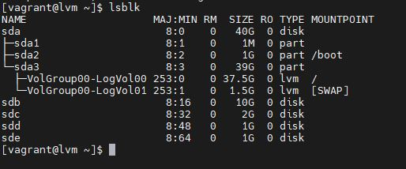
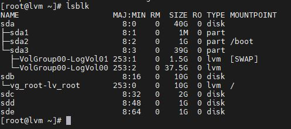
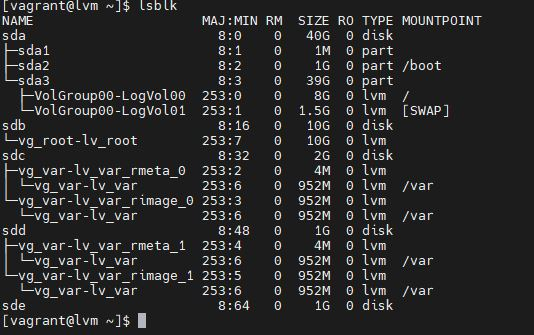

# Домашнее задание: "Работа с LVM"

## Описание/Пошаговая инструкция выполнения домашнего задания:

1. уменьшить том под / до 8G
2. выделить том под /home
3. выделить том под /var (/var - сделать в mirror)
4. для /home - сделать том для снэпшотов
5. прописать монтирование в fstab (попробовать с разными опциями и разными файловыми системами на выбор)
6. Работа со снапшотами:
*    сгенерировать файлы в /home/
*    снять снэпшот
*    удалить часть файлов
*    восстановиться со снэпшота

В файле lvm1.log вывод программ script с созданием временног тома и перенос в него временного загрузочного тома. В файле lvm2.log уменьшение тома / до 8Гб и выделение тома var под зеркало. В файле lvm3.log загрузка с нового тома / и удаление старого. А так же работа со снапшотом.
На скрине  том до уменьшения. 
На скрине  загрузка с временного тома
На скрине  уменьшеный том / до 8Гб
